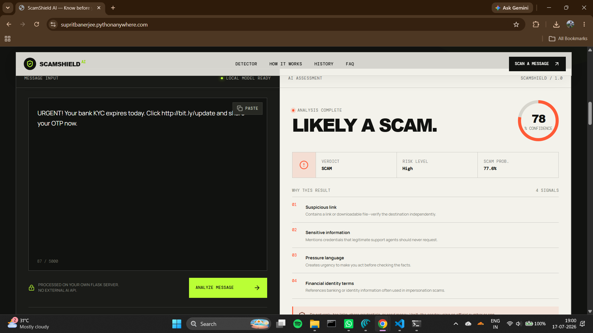
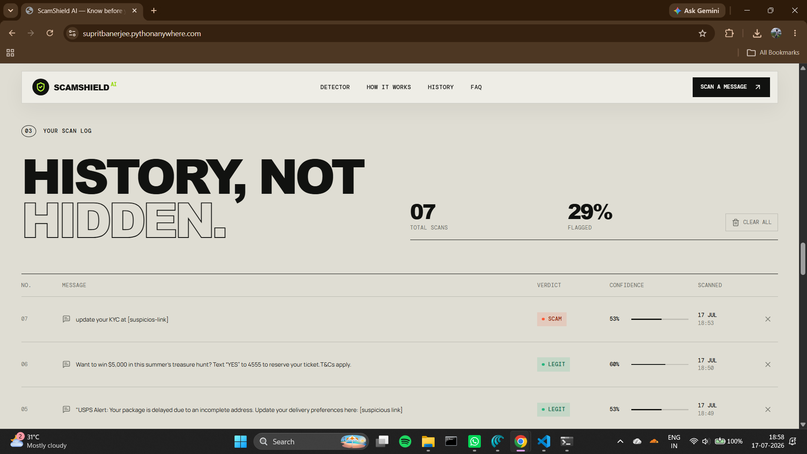
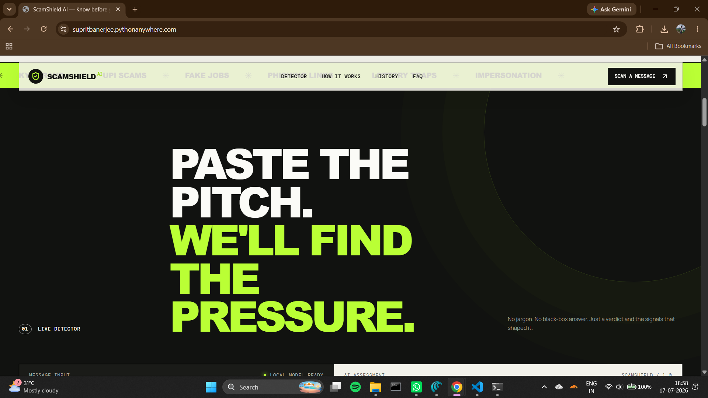
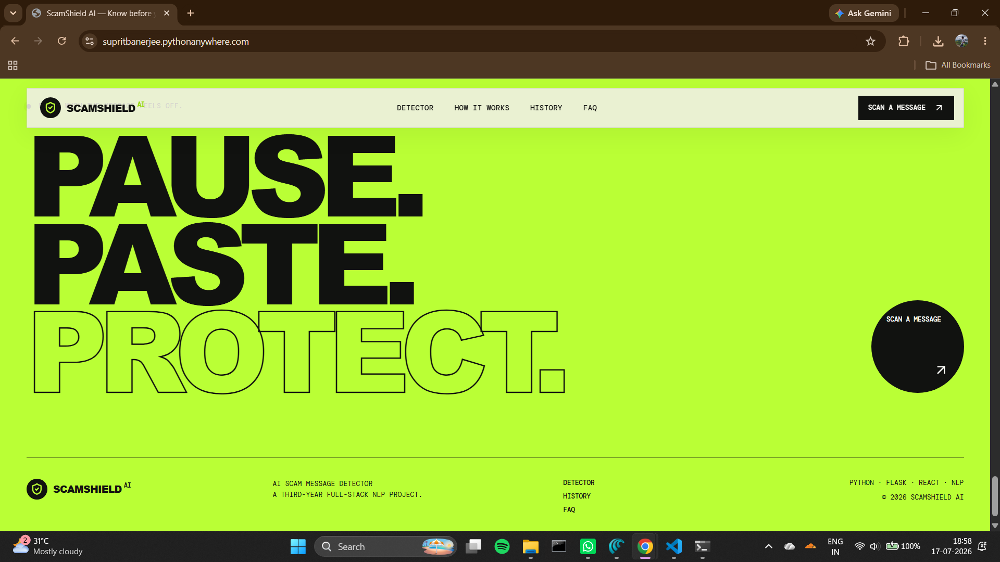

# ScamShield AI

An explainable AI scam-message detector built as a third-year portfolio project. Paste an SMS or WhatsApp message to get a **SCAM / LEGIT** verdict, confidence score, risk level, plain-English warning signals, and persistent history.

 

## Live Demo

- **Website:** https://supritbanerjee.pythonanywhere.com/
- **API Health:** https://supritbanerjee.pythonanywhere.com/api/health
- **Source Code:** https://github.com/supritbanerjee/scamshield-ai

> The free PythonAnywhere web app may require a reload after a period of inactivity.


## Highlights

- Real NLP pipeline: word + character TF-IDF and logistic regression
- Explainable rule layer for links, urgency, payments, credential requests, threats, and remote access
- REST API with validation, CORS, JSON errors, and security headers
- SQLite scan history with delete-one and clear-all actions
- Original responsive React interface with custom AI-generated project artwork
- India-aware examples for KYC, UPI, fake jobs, parcels, lotteries, and impersonation

## Project structure

```text
scam-detector/
├── backend/
│   ├── app.py          # Flask API, SQLite, and production React serving
│   └── model.py        # NLP training, inference, and explanations
├── frontend/
│   ├── public/         # Original project imagery
│   └── src/            # React UI and responsive CSS
├── tests/              # Flask API smoke tests
├── package.json        # Optional static build helper
├── Dockerfile          # Optional portable container deployment
├── PYTHONANYWHERE_DEPLOYMENT.md  # Free one-service deployment guide
├── requirements.txt
└── README.md
```

## Free live deployment — no card

The complete app can run from one free **PythonAnywhere Beginner** web app:

- React is built locally with Vite and the production `frontend/dist` output is committed to GitHub.
- Flask serves the compiled React site and all `/api` routes from the same domain.
- scikit-learn runs the NLP detector and SQLite stores demo history.
- No Docker, GPU, paid database, custom domain, or hosting card is needed.

See **[PYTHONANYWHERE_DEPLOYMENT.md](PYTHONANYWHERE_DEPLOYMENT.md)** for the complete guide. The `Dockerfile` remains only as an optional portable configuration.

## Run locally

### 1. Start the Flask API

```bash
cd scam-detector
python -m venv .venv
# Windows: .venv\Scripts\activate
# macOS/Linux: source .venv/bin/activate
pip install -r requirements.txt
python backend/app.py
```

The API runs at `http://localhost:5000`.

### 2. Start the React frontend

Open a second terminal:

```bash
cd scam-detector/frontend
npm install
npm run dev
```

Open the Vite URL shown in the terminal (normally `http://localhost:5173`).

## API

| Method | Route | Purpose |
|---|---|---|
| `GET` | `/api/health` | Service and model status |
| `POST` | `/api/analyze` | Analyze `{ "message": "..." }` |
| `GET` | `/api/history?limit=20` | Get recent scans and totals |
| `DELETE` | `/api/history/:id` | Delete one scan |
| `DELETE` | `/api/history` | Clear all history |

Example:

```bash
curl -X POST http://localhost:5000/api/analyze \
  -H "Content-Type: application/json" \
  -d '{"message":"Urgent! Your KYC expires today. Click this link and share OTP."}'
```

## How the model works

1. A small labelled seed corpus is vectorised from two views: word 1–2 grams and character 3–5 grams.
2. Logistic regression estimates scam probability.
3. A deterministic rule layer identifies high-risk patterns and creates explanations.
4. The scores are blended; the UI shows both the final confidence and the evidence.

This makes the project easy to run locally and discuss in an interview. For production, replace the seed corpus with a larger reviewed dataset, calibrate probabilities on a held-out test set, add multilingual support, and avoid retaining raw messages by default.

## Test and evaluate

```bash
pip install -r requirements-dev.txt
pytest -q
python backend/evaluate.py
```
## Screenshots

### Landing Page


### Explainable Scam Result



### Scan History



### Bonus Screenshots of the website




